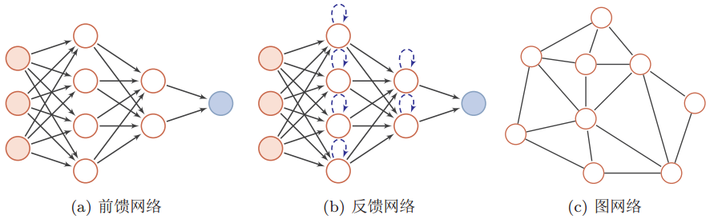
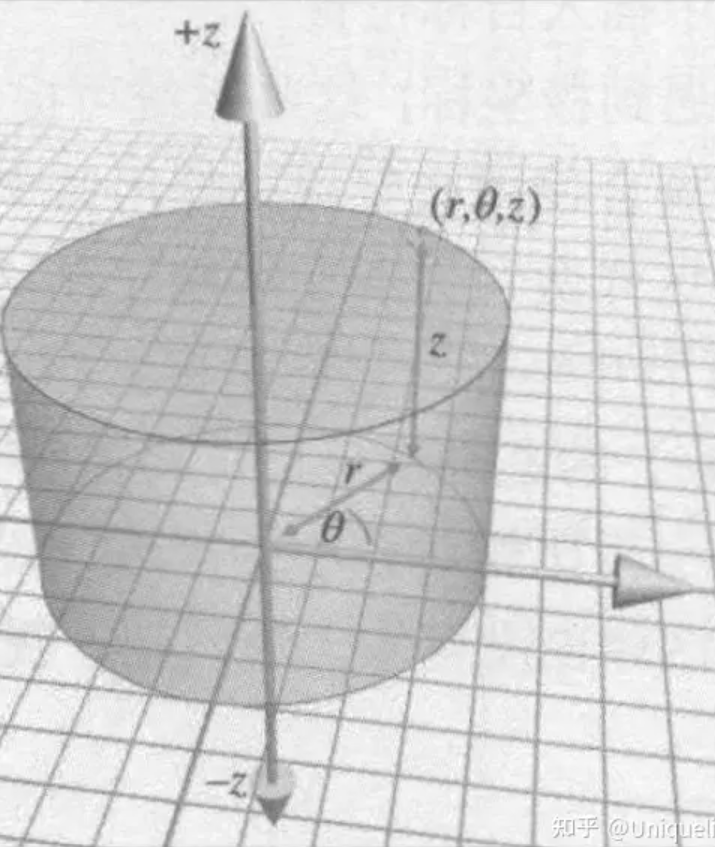
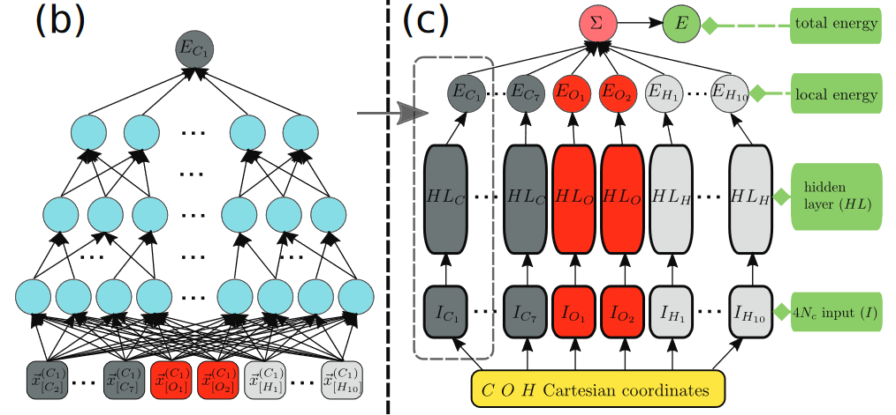
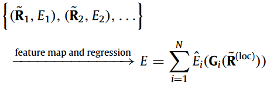

---
layout:default
---

# 1. Deep Potential发展时间线

|时间|内容|论文|
|-|-|-|
|1995|用神经网络模型拟合势能面(数据来自经验势计算结果)|Blank, T. B.; Brown, S. D.; Calhoun, A. W.; Doren, D. J. Neural Network Models of Potential Energy Surfaces. J. Chem. Phys. 1995, 103 (10), 4129–4137. https://doi.org/10.1063/1.469597.|
|2007|BPNN模型发表|Behler, J.; Parrinello, M. Generalized Neural-Network Representation of High-Dimensional Potential-Energy Surfaces. Phys. Rev. Lett. 2007, 98 (14), 146401. https://doi.org/10.1103/PhysRevLett.98.146401.|
|2016|AMP发表|Khorshidi, A.; Peterson, A. A. Amp: A Modular Approach to Machine Learning in Atomistic Simulations. Computer Physics Communications 2016, 207, 310–324. https://doi.org/10.1016/j.cpc.2016.05.010.|
|2017|Deep Potential发表|Han, J.; Zhang, L.; Car, R.; E, W. Deep Potential: A General Representation of a Many-Body Potential Energy Surface. CiCP 2018, 23 (3). https://doi.org/10.4208/cicp.OA-2017-0213.|
|2018|DeepMD发表|Zhang, L.; Han, J.; Wang, H.; Car, R.; E, W. Deep Potential Molecular Dynamics: A Scalable Model with the Accuracy of Quantum Mechanics. Phys. Rev. Lett. 2018, 120 (14), 143001. https://doi.org/10.1103/PhysRevLett.120.143001.|
|2018|DeepPot-SE发表|Zhang, L.; Han, J.; Wang, H.; Saidi, W.; Car, R.; E, W. End-to-End Symmetry Preserving Inter-Atomic Potential Energy Model for Finite and Extended Systems. In Advances in Neural Information Processing Systems; Curran Associates, Inc., 2018; Vol. 31.|
|-|-|-|
||||

# 2. 神经网络学习

## 2.1 神经网络种类

参考：https://blog.csdn.net/suibianshen2012/article/details/119119921

### 2.1.1 前馈神经网络 Feed Forward NN

前馈神经网络中，把每个神经元按接收信息的先后分为不同的组，每一组可以看做是一个神经层。每一层中的神经元接收前一层神经元的输出，并输出到下一层神经元。整个网络中的信息是朝着一个方向传播的，没有反向的信息传播（和误差反向传播不是一回事），可以用一个有向无环图来表示。

前馈神经网络包括全连接前馈神经网络和卷积神经网络。

前馈神经网络可以看做是一个函数，通过简单非线性函数的多次复合，实现输入空间到输出空间的复杂映射。

（主要用于拟合函数，通过复杂的特征转换，可以以任意精度来近似任何一个有界闭集函数）

（利用梯度下降法计算权重参数时，需要计算损失函数对参数的偏导数，如果用链式法则对每个参数逐一求偏导，涉及到矩阵微分，效率比较低。所以在神经网络中经常使用反向传播算法来高效地计算梯度）

（误差反向传播算法：第$l$层的一个神经元的误差项等于该神经元激活函数的梯度，再乘上所有与该神经元相连接的第$l+1$层的神经元的误差项的权重和。）

### 2.1.2 反馈神经网络 Feed Back NN

反馈神经网络中神经元不但可以接收其他神经元的信号，而且可以接收自己的反馈信号。和前馈神经网络相比，反馈神经网络中的神经元具有记忆功能，在不同时刻具有不同的状态。反馈神经网络中的信息传播可以是单向也可以是双向传播，因此可以用一个有向循环图或者无向图来表示。

常见的反馈神经网络包括循环神经网络、Hopfield网络和玻尔兹曼机。

而为了进一步增强记忆网络的记忆容量，可以映入外部记忆单元和读写机制，用来保存一些网络的中间状态，称为记忆增强网络，比如神经图灵机。

参考：https://blog.csdn.net/weixin_39653948/article/details/105161038

（反馈神经网络需要考虑输出与输入之间在时间上的延迟，需要动态方程来描述系统的模型）

（前馈神经网络的计算过程一般比较慢，收敛速度也比较慢；反馈神经网络主要采用Hebb学习规则，一般情况下计算的收敛速度很快）

（相比前馈神经网络，反馈神经网络更适合应用在联想记忆和优化计算等领域）

### 2.1.3 图网络

前馈神经网络和反馈神经网络的输入都可表示为向量或者向量序列，但实际应用中很多数据都是图结构的数据，比如知识图谱、社交网络和分子网络等。这时就需要用到图网络来进行处理。

图网络是定义在图结构数据上的神经网络，图中每个结点都由一个或者一组神经元组成。结点之前的连接可以是有向的，也可以是无向的。每个结点可以收到来自相邻结点或自身的信息。

# 3. Deep Potential构建

> For a system of N atoms, our neural network consists of N small, almost independent, copies. Each copy is a sub-network with a scalar output, corresponding to a different atom in the system. The size of the input data for a sub-network is at most 4Nc (see the detailed description below), where Nc is the number of atoms within the adopted cut-off radius Rc (Fig. 1 (b) and (c)). If the number of atoms within Rc fluctuates, Nc is the largest fluctuating number. We find that adopting a finite Rc is sufficient in all the extended material systems considered here.

假设一个系统里有N个原子，那么就会有N个几乎独立的小副本，每个副本（对应不同原子）都是一个带有标量输出的子网络。

而我们实际关心的是每个原子$R_c$半径内的信息，所以子网络的输入其实就是$R_c$半径内的原子（位置）信息，但是在分子动力学的过程中，很有可能会出现原子动着动着就跑到$R_c$外面的情况，所以应当选取波动中最大的原子数$N_c$作为子网络需要考虑的原子数量，那么子网络的输入数据大小就是$4N_c$。

> Next, we introduce a local Cartesian coordinate frame for each atom. In this frame, the atom under consideration is taken to be at the origin and is labelled as “0”. We fix the x and y axes in terms of the atom 0 and its two non-collinear nearest neighbors that we label “1” and “2”, respectively, in order of increasing distance. For organic molecules, we exclude hydrogen atoms in the definition of “1” and “2”. The x-axis is defined by the 0-1 direction, the z-axis is along the direction of the cross product of 0-1 and 0-2, and the y-axis is the cross product of z and x. In this Cartesian frame, the coordinates of all the atoms falling inside the cut-off radius centered at the origin, excluding atom 0, define the input data for the corresponding sub-network. In practice, we found that the combination t1{r,cosθ,cosφ,sinφu, where pr,θ,φq are the polar coordinates, is a much better representation than the Cartesian coordinates px,y,zq. This is so because 1{r automatically differentiates the atoms according to their inverse distances from the tagged atom at the origin. Since the number of inputs has been fixed for each sub-network, we feed 0 to the remaining input entries of the sub-network when the number of atoms falling inside the cut-off radius centered at atom 0 is less than Nc. This means putting some additional atoms at infinity and hence has negligible influence on the results upon training. In most cases (see below) we find that it is sufficient to use the radial and angular coordinates of a smaller subset of atoms closer to the origin while keeping only the radial coordinates of all the other atoms within the cut-off radius.

这部分讲解了整体坐标向局域坐标转换的过程。核心思想是，以选中的原子为圆心，向外进行扩展，直到$R_c$。在这个过程中，可以找到距离圆心最近、次近......的点，分别标记为1，2......（注意，在有机分子体系中无视了氢原子，为什么？）。

局域坐标怎么构建？坐标系怎么来的？第0个原子（圆心）和第1个原子的连线，记为x轴。第0个原子（圆心）和第2个原子的连线，记为y轴。x轴和y轴的叉积就是z轴。这个操作其实不是很复杂，直接就构建出了一个以第0个原子为原点的笛卡尔坐标系（笛卡尔坐标系是直角坐标系和斜角坐标系的统称，这里是斜角坐标系）。

但是吧，作者又进一步发现，极坐标的表示形式$(1/r,\cos\theta,\cos\phi,\sin\phi)$表现更好（其中$(r,\theta,\phi)$是极坐标），因为$1/r$这个东西其实本身就代表着两个原子间相互作用的权重（r越小，作用的权重更高），所以极坐标形式确实有可能带来更好的效果。（但是$\theta,\phi$这两个参数在这里出现对神经网络有什么帮助？仅仅为了区分原子吗？）

实际上，极坐标的定义仍然不能脱离笛卡尔坐标系，因为$\phi$角度的定义仍然需要z轴。

当$R_c$半径内的原子数小于$N_c$时，其余的维度就可以直接补0，相当于$r\rightarrow\infin$，在无穷远处放置原子，自然对中心原子的作用也就没有影响了。

> The sub-networks are only coupled through summation in the last step of the scheme, when we compute the total energy. From a qualitative point of view, one can think about the sub-networks as providing different local energy contributions to the potential energy surface. To preserve the permutational symmetry of the input, in each sub-network the atoms are first assigned to different groups corresponding to the different atomic species, and then within each one of these groups the atoms are sorted in order of increasing distance to the origin. Global permutational symmetry is preserved by assigning the same parameters to all the sub-networks corresponding to atoms of the same species.

计算总能量这一步，每个子网络（对应每个原子）都会输出一个能量，然后这些能量直接加和得到总能量。这个过程可以被理解为每个原子（对应的局部结构）都提供了一份自己的势能，为势能面提供了不同的局部能量贡献。（这样看的话，实际上$R_c$内的每个原子都参与了能量贡献）

这个过程确实不太好理解，主要是与每个原子对应的势能$E_i$究竟是什么东西？有什么物理意义？

张林峰老师在另外一篇论文（Representing high-dimensional potential-energy surfaces for reactions at surfaces by neural networks）里给了这样一个通用公式：

$$
X = \sum_i{X_i}=\sum_i{X_i(\{\bold{r}_j\in N_i\})},N_i=\{j,r_{ij}<r_c\}
$$

势能是个标量，因此可以代入到这个式子中。拆分(decompose)出来的每个$X_i$都被称为局部量(local quantity)。但是为什么可以这么拆呢？

在Born-Oppenheimer近似的框架下，体系的基态势能E仅与原子核的位置有关，即$E=E(\widetilde{\bold{R}})$，其中$\widetilde{\bold{R}}=\{\bold{R}_1,\bold{R}_2,\dots,\bold{R}_N\}$。

这里插一部分Born-Oppenheimer相关的内容。对于包含原子核和电子的系统，其基本的哈密顿量可以写为：

$$
\hat{H}=\hat{T}_N+\hat{T}_e+\hat{U}
$$

其中$\hat{U}$包含了所有的相互作用项（电子间、原子核间、电子-原子核间）。原子核的运动速度极慢，即原子核的动能$\hat{T}_N$极小，可以被视为微扰。

整个系统的薛定谔方程可以被写为：

$$
\hat{H}\Psi_s(\{\bold{r},\bold{R}\})=E_s\Psi_s(\{\bold{r},\bold{R}\})
$$

其中，$s=1,2,3,...$代表电子-原子核耦合系统中的各个态：

$$
\Psi_s(\{\bold{r},\bold{R}\}) = \sum_i{\chi_{si}(\{\bold{R}\})\Psi_i(\{\bold{r}\}:\{\bold{R}\})}
$$

这个式子就是将电子-原子核的波函数(矩阵)，拆分为一系列固定原子核位置$\{\bold{R}\}$情况下电子态波函数$\Psi_i(\{\bold{r}\}:\{\bold{R}\})$的加和。（感觉和贝叶斯定理和全概率公式很像，毕竟都是与概率相关的）

进行变换(薛定谔方程左乘$\Psi_i(\{\bold{r}\}:\{\bold{R}\})$)可以得到:

$$
[T_N+E_i(\{\bold{R}\})-E_s]\chi_{si}(\{\bold{R}\}) = -\sum_{i'}{C_{ii'}\chi_{si'}(\{\bold{R}\})}
$$

其中$C_{ii'}=A_{ii'}+B_{ii'}$,

$$
A_{ii'}(\{\bold{R}\})=\sum_J{\frac{m_e}{M_J}\bra{\Psi_i(\{\bold{r}\}:\{\bold{R}\})}\nabla_J\ket{\Psi_{i'}(\{\bold{r}\}:\{\bold{R}\})}\nabla_J} \\

B_{ii'}(\{\bold{R}\})=\sum_J{\frac{m_e}{2M_J}\bra{\Psi_i(\{\bold{r}\}:\{\bold{R}\})}\nabla_J^2\ket{\Psi_{i'}(\{\bold{r}\}:\{\bold{R}\})}}
$$

从A和B的式子中可以发现，与电子相关的项都被积掉了（在绝热近似的情况下，即非对角项互相正交，相乘为0），也就是说，A和B只与原子位置相关，与电子无关，这种情况代表着：假设电子在原子核移动时保持在给定状态$m$，虽然电子波函数$\Psi_i(\{\bold{r}\}:\{\bold{R}\})$发生了改变，状态$m$的能量也发生了改变，但是电子的态并没有发生改变，也没有发生不同自由度间的能量传递(仅在电子态发生变化时才有能量传递)。

然后它证明了$A_{ii}=0$？进而推导得到$U_i(\{\bold{R}\})=E_i(\{\bold{R}\})+B_{ii}(\{\bold{R}\})$，即在绝热近似中，对于每个电子态$i$而言，核运动可以被描述为：

$$
[-\sum_J{\frac{m_e}{2M_J}\nabla^2_J+U_i(\{\bold{R}\})-E_{ni}}]\chi_{ni}(\{\bold{R}\})=0
$$

进一步忽略了$B_{ii}$项，就得到了计算声子能量的“冻结声子”法。实际上，由于核的质量非常大，因此$B_{ii}$项通常非常小，因此绝热近似是一个非常好的近似。

综上，我们可以得到结论，在绝热近似的框架下，所有电子、原子核间的相互作用都仅与原子核的位置有关，对于某个特定的电子态$i$，其$U_i(\{\bold{R}\})$是随着原子核的移动而演化的。

在AMP的论文（Amp: A modular approach to machine learning in atomistic simulations）里，作者提到，构建经验势的一个常用方法就是将系统的总能拆分为原子能量的贡献。这说明“原子中心”框架（"atom-centered" framework）可能已经是一个通用的插值势能面（PES）的方法。（与“原子中心”相对的就是“图像中心（image-centered）”）

AMP的论文原始陈述是这样的：

> Using the ***locality approximation***, each atomic energy contribution $E_i$ can be taken to depend only on the local environment of atom $i$ as
>
> $$
> E=\sum_{i=1}^N{E_i(\widetilde{\bold{R}}^{(loc)})}
> $$

这里一个比较重要的词语就是“locality approximation”局域近似，但是局域近似具体指代的是哪个理论，作者并没有给出详细介绍，可能默认为非常常见的近似，还需要之后继续查询论文。这个理论来源尚不明确的公式就是之后Deep Potential、Deep H以及各类基于神经网络的材料计算工具的基础。

之后可以补充一些关于“原子中心”与“图像中心”的理论。

> As a result, an "atom-centered" framework of learning $E$ becomes possible. In this framework, instead of directly modeling the total image energy $E(\widetilde{\bold{R}})$, the atomic energy contributions $E_i$ are modeled, defined in the much dimensionally reduced space of local environments $\widetilde{\bold{R}}^{(loc)}$. This local environment is typically defined to be a sphere of radius $R_c$ (the "cutoff radius") surrounding the position of atom $i$; however, longer-range interactions can still be included via techniques such as **Ewald summations**. Similar to Eq. (3), a proper mapping from the space of now local environments into a feature space $F$ representing the functional dependence of local energetics can further improve interpolation, leading to
>
> 
>
> where $\bold{G}_i(\widetilde{\bold{R}}^{(loc)})\in F$ in the feature vector of atom $i$, and $\hat{E}_i$ is the machine-learned function that approximates $E_i$. In the remainder of this paper, we will sometimes refer to the feature vector as the "fingerprint" of an atom's local environment, after the convention of **Behler** et al. [41].

这里就引出了大部分材料领域使用的神经网络的基本框架，即：

1. 所需数据集包括原子坐标$\widetilde{\bold{R}}_i$和与之对应的$E_i$（可以额外添加其它数据作为辅助）

2. 在输入的原子坐标基础上计算得到局域原子坐标$\widetilde{\bold{R}}^{(loc)}$

3. 在局域坐标的基础上得到特征向量$\bold{G}_i$（也就是物理描述符？），这个应该就是最重要的东西，后面embedding net之类的方法其实就是为了得到这个东西。

4. 训练神经网络，得到特征向量与能量的映射关系，即可以通过$\bold{G}_i$映射到$E_i$

5. 对$E_i$进行加和，得到体系的总能量$E$

绕不过去的就是Behler-Parrinello neural network (BPNN)这篇文章。

好吧，回到Deep Potential的文章，看一看Deep Potential是怎么处理物理描述符的。

> From a qualitative point of view, one can think about the sub-networks as providing different local energy contributions to the potential energy surface.

从定性的角度来看，每个（原子对应的）子网络为势能面提供了不同的局部能量贡献。这个可能可以理解为：

$$
E^{contrib}_i=\sum_j^{N_c}{x_j E^{contrib}_{ij}}
$$

其中，$E^{loc}_i$是第$i$个子网络为势能面提供的能量贡献，而这个能量贡献可以进一步拆分，拆为$R_c$半径内$N_c$个原子的贡献，即$x_j$是$R_c$半径内第$j$个原子对子网络能量贡献的权重，$E^{contrib}_{ij}$就是$R_c$半径内第$j$个原子所能够提供的能量。

在理想情况下，我认为$E^{contrib}_{ij}$应该只与原子种类有关，即该原子对势能面能够起到贡献的最大能量，具体化学环境（比如原子相对位置等）影响的应该是权重$x_j$的贡献，而$x_j$也就是在神经网络更新过程中获得的参数。

但是实际上这样理解很有可能是不合理的，神经网络是一个非线性过程，其对应的表达式可能非常复杂，而且大概率不是一个简单加和的过程。原子对势能面能够起到的最大贡献能量也是无法衡量甚至难以找到一个合理的物理表述的，本质上势能面就应当是一系列原子相互作用的结果。

势能面是什么？在我的理解中，势能面实际上就应当是一个高维映射的函数，即

$$
pE=F(\bold{R}_1,\bold{R}_2,\dots,\bold{R}_{N})
$$

假设以$R_c$为半径的局域环境中，圆心是1号原子，坐标为$\bold{R}_1$。那么假设1号原子要发生运动，它所受到的外势应当与$R_c$半径内所有其它原子的坐标有关，那么假设固定$R_c$半径内除1号原子以外其它所有原子的坐标，那么1号原子所受到的势能就仅与自己的位置有关了：

$$
pE=F(\bold{R}_1)=F(x_1,x_2,x_3)
$$

那么显而易见，这个函数就可以绘制出将1号原子放置在$R_c$范围内每个点处会受到的势能。基于这个函数，绘制等能面也就成为了一种可能。

当然，这样理解也不准确，毕竟局域坐标是根据1号原子的位置构建的，移动1号原子的位置可能会直接导致最近邻和次近邻原子改变。但是，1号原子在原点处的能量梯度是可以确定的，那么求力（动能）也就成为可能（根据位力定理），于是原子的运动方向也就可以确定，那么按照力的大小就可以设计原子移动的步长，进行不断的迭代求解。

> To preserve the permutational symmetry of the input, in each sub-network the atoms are first assigned to different groups corresponding to the different atomic species, and then within each one of these groups the atoms are sorted in order of increasing distance to the origin. Global permutational symmetry is preserved by assigning the same parameters to all the sub-networks corresponding to atoms of the same species.

为了保持输入的**排列对称性**，在每个子网络中，$R_c$半径内的原子首先需要根据原子种类分组，然后每个组内再根据距离原点的距离进行排序。重点：在所有的子网络中，每种原子的**参数**都相同。我认为，这个地方的**参数**应当指的是排序方式，毕竟每个$R_c$半径内部的原子数目可能都不一样，可能我这个球里有3个A原子，5个B原子，另外一个球里有5个A原子，2个B原子，再往外一个球里有7个A原子1个B原子，如果每个球的子网络维度和顺序都不一样，无疑是个很麻烦的事情，那么就可以直接让每个子网络中，都有7个A原子的输入，5个B原子的输入，反正是从近到远排布，大不了空下来的位置就当作无限远的原子。

这样做下来，子网络确实就有了全局排列对称性，实际上，都不需要那么多子网络了，干脆一套网络应用到所有$R_c$球上就好了。

> The sub-network for Ei consists of an encoding and a fitting neural network. The encoding network is specially designed to map the local environment Ri to an embedded feature space, which preserves the translational, rotational, and permutational symmetries of the system. The fitting network is a fairly standard fully-connected feedforward neural network with skip connections, which maps the embedded features to an "atomic energy". The optimal parameters for both the encoding and fitting networks are obtained by a single end-to-end training process to be specified later.

这是另外一篇文献的内容了，Deep Potential虽然在它的论文中表示，他们用的描述符是$(1/r,\cos\theta,\cos\phi,\sin\phi)$，但是实际上在Deep Potential发表后不久，他们就继续发展了一套能够保留系统平移、旋转、排列对称性的新描述符，也就是DeepPot-SE。这套新的描述符是基于Embedding Net的。

旧的描述符在DeepMD-kit中也是可用的，描述符选择`loc_frame`就可以了，但是其它大部分的描述符，都已经是基于Embedding Net了，比如`se_e2_a`之类的，从需要的参数也很容易看出来是这样。

平移、旋转对称性倒是也很简单，做一个对称矩阵就好了，$r_cut$范围内的局域原子坐标本身就带有平移对称性，原子整体位移并不会影响原子间的相对位置,旋转对称性也是同理，构建对称矩阵的方式如下：

$$
\Omega^i\equiv \bold{R}^i(\bold{R}^i)^T
$$

其中，$\bold{R}^i$是3行$N_i$列的矩阵。话说回来，晶体点阵的旋转、平移对称性反而是破缺的，因为只在特定的平移矢量和旋转角度上，点阵才能保持不变。

但是这样构建出来的对称矩阵实际上是有问题的，因为它不能满足交换对称性。理论上，同种原子交换位置，体系的性质仍然不变，因为所有同种原子都是等价的。但是，在上面构建出来的对称矩阵中，交换原子位置相当于修改行或列的位置，会导致对称矩阵不再对称，这样显然是不合理的，因此这个对称矩阵不能直接被应用在描述符中。

